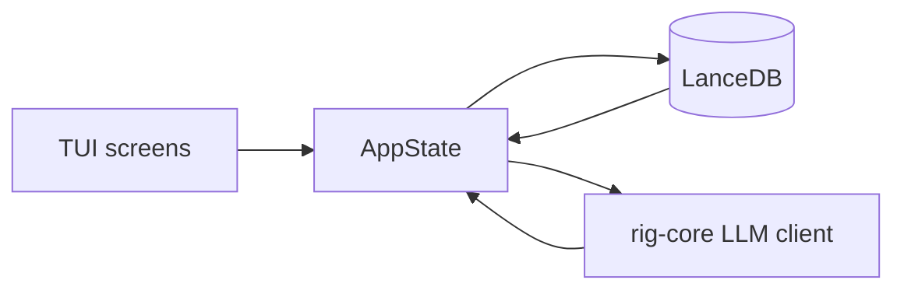
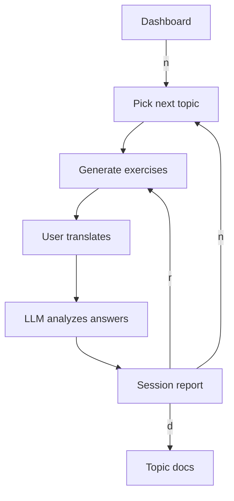

# Open Course CLI

Terminal AI tutor for language learning. Exercises, lessons, and answer analysis are generated by an LLM provider you choose.

## Install

The fastest way to get the latest release:

```bash
curl -sSL https://github.com/scriptology/open-course-cli/releases/latest/download/open-course-cli-installer.sh | sh
```

The installer detects macOS (Apple Silicon / Intel) and Linux x86_64, then downloads the matching binary into `~/.local/bin` (or `/usr/local/bin` if writable). It also creates a symlink `opencourse`, so both commands work:

```bash
open-course-cli
# or
opencourse
```

Add the directory to your PATH if needed:

```bash
export PATH="$HOME/.local/bin:$PATH"
```

You can also install with `cargo` if you already have the Rust toolchain:

```bash
cargo install open-course-cli
```

## Quick start

```bash
cargo run
```

Data is stored in `.open-course-cli/` under the current directory. Use `--data-dir` to change the location:

```bash
cargo run -- --data-dir /path/to/project
```

Quit with `Ctrl+C` or `Esc`/`q`.

Data lives in `.open-course-cli/`:

- `config.json` — provider, preferences, and one profile per language pair.
- `pairs/{native-target}/db/` — per-pair LanceDB tables (`curriculum`, `progress`, `history`, `reviews`, `learning_items`).

Each language pair is isolated; provider settings and preferences are global.

## Onboarding

On the first launch a wizard asks for:

- Native and target languages (ISO 639-1 codes, e.g. `ru` → `en`).
- Age and self-assessed CEFR level (`A1`–`C2`).
- Exercises batch size (`2`–`5`).
- LLM provider, API key (or leave blank to use the provider's `*_API_KEY` environment variable), base URL (only asked for Custom/Ollama), and model.

After onboarding the app runs model diagnostics and opens the curriculum so you can generate the first course.

## How it works



1. The dashboard shows progress, activity, and weak topics.
2. Pressing `n` starts the next balanced session: a new curriculum topic or a decayed review topic.
3. The LLM generates a batch of translation exercises for the chosen topic.
4. After the batch, answers are analyzed and scores are updated.
5. Weak topics and micro-learning items are tracked for spaced repetition.

### Session lifecycle



## Providers

Supported out of the box: OpenAI, Anthropic, Google Gemini, DeepSeek, Mistral, OpenRouter, and Ollama. Any other OpenAI-compatible endpoint can be used via the **Custom** provider.

Onboarding fetches the list of available models automatically. For local Ollama no API key is needed; for custom endpoints set the base URL and pick `chat/completions` or `messages` depending on the API. For the other providers, leaving the API key blank falls back to the matching environment variable (`OPENAI_API_KEY`, `ANTHROPIC_API_KEY`, `GEMINI_API_KEY`, `DEEPSEEK_API_KEY`, `MISTRAL_API_KEY`, `OPENROUTER_API_KEY`) if it's set.

## Architecture

- `src/ui/` — ratatui screens and widgets.
- `src/core/` — session orchestration, dashboard stats, spaced-repetition logic.
- `src/db/` — LanceDB tables and schemas.
- `src/llm/` — LLM client, prompts, streaming, and diagnostics.

## Development

```bash
# Run all tests
cargo test

# Debug LLM exercise generation
python3 scripts/debug_exercises.py
```

## Releasing a new version

Releases are built automatically from Git tags via GitHub Actions.

1. Bump the version in `Cargo.toml` (and run `cargo build` to update `Cargo.lock`).
2. Commit and push the version bump.
3. Create and push a tag:

   ```bash
   git tag v0.2.0
   git push origin v0.2.0
   ```

4. GitHub Actions will build binaries for:
   - `aarch64-apple-darwin` (Apple Silicon)
   - `x86_64-apple-darwin` (Intel Mac)
   - `x86_64-unknown-linux-gnu` (Linux)

   …and publish them to the GitHub Release.
5. The installer script at `installer.sh` always points to the latest release.

### Supported release platforms

| Target | OS | Architecture |
|--------|----|--------------|
| `aarch64-apple-darwin` | macOS | Apple Silicon |
| `x86_64-apple-darwin` | macOS | Intel |
| `x86_64-unknown-linux-gnu` | Linux | x86_64 |
