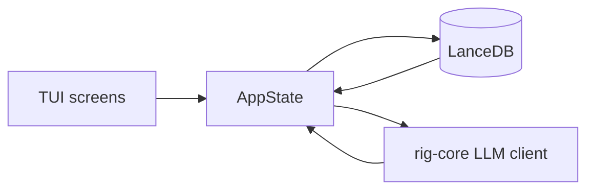
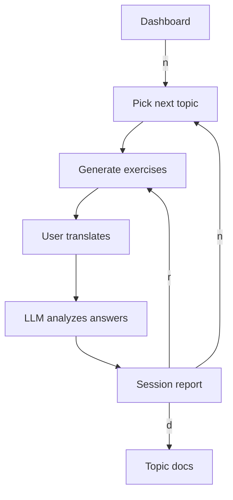
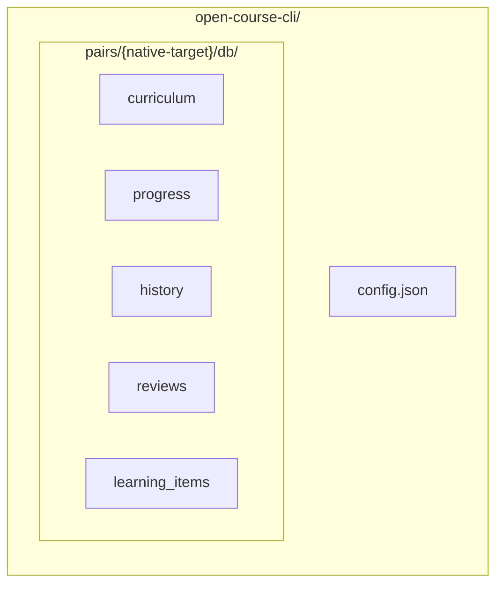
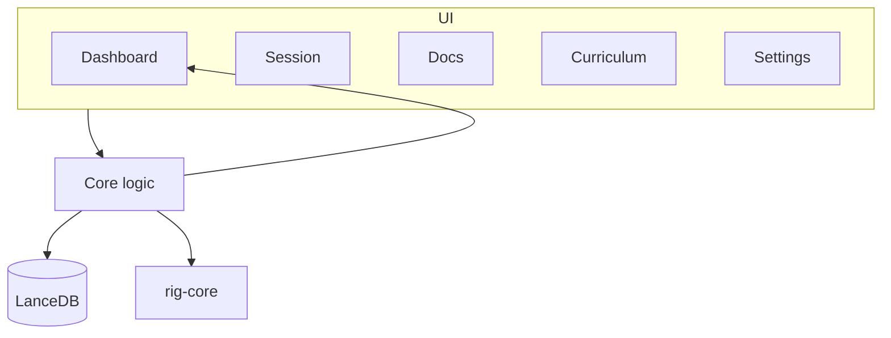

# Open Course CLI

Terminal AI tutor for language learning. Exercises, lessons, and answer analysis are generated by an LLM provider you choose.

## Quick start

```bash
cargo run
```

Data is stored in `.open-course-cli/` under the current directory. Use `--data-dir` to change the location:

```bash
cargo run -- --data-dir /path/to/project
```

Quit with `Ctrl+C` or `Esc`/`q`.

## Onboarding

On the first launch a wizard asks for:

- Native and target languages (ISO 639-1 codes, e.g. `ru` → `en`).
- Age and self-assessed CEFR level (`A1`–`C2`).
- Exercises batch size (`2`–`5`).
- LLM provider, API key, base URL, and model.

After onboarding the app runs model diagnostics and opens the curriculum so you can generate the first course.

## How it works



1. The dashboard shows progress, activity, and weak topics.
2. Pressing `n` starts the next balanced session: a new curriculum topic or a decayed review topic.
3. The LLM generates a batch of translation exercises for the chosen topic.
4. After the batch, answers are analyzed and scores are updated.
5. Weak topics and micro-learning items are tracked for spaced repetition.

### Session lifecycle



## Data layout



- `config.json` — global provider, preferences, and one profile per language pair.
- `pairs/{native-target}/db/` — per-pair LanceDB tables:
  - `curriculum` — generated course topics.
  - `progress` — topic scores and mastery.
  - `history` — session summaries.
  - `reviews` — AI-generated topic explanations.
  - `learning_items` — micro-topics (word pairs, small patterns) for spaced review.

Each language pair is isolated: progress, history, curriculum, and reviews are not shared. Provider settings and preferences are global.

## Provider notes

### OpenCode Go

Set Base URL to `https://opencode.ai/zen/go/v1` and choose the endpoint that matches the model:

- `chat/completions` — GLM, Kimi, DeepSeek, MiMo.
- `messages` — Qwen, MiniMax.

### Ollama

Use base URL `http://localhost:11434/v1`. No API key is required.

## Architecture



- `src/ui/` — ratatui screens and widgets.
- `src/core/` — session orchestration, dashboard stats, spaced-repetition logic.
- `src/db/` — LanceDB tables and schemas.
- `src/llm/` — LLM client, prompts, streaming, and diagnostics.

## Development

```bash
# Run all tests
cargo test

# Debug LLM exercise generation
python3 scripts/debug_exercises.py
```
