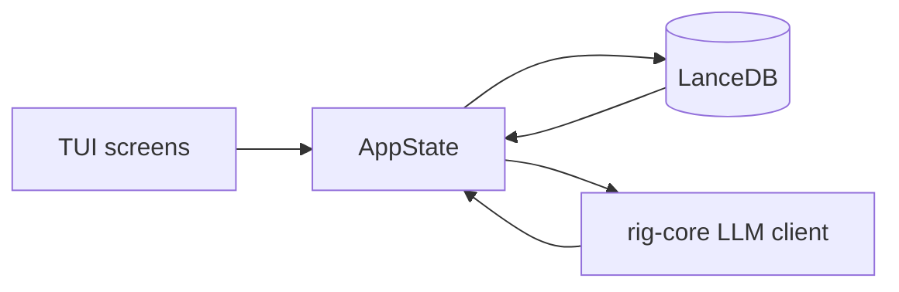
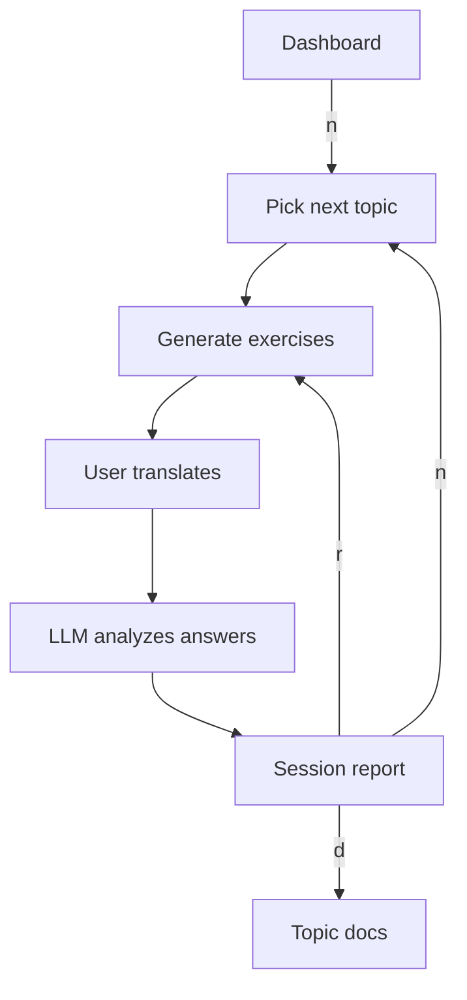

# Open Course CLI

Terminal AI tutor for language learning. Exercises, lessons, and answer analysis are generated by an LLM provider you choose.

## Install

The fastest way to get the latest release:

```bash
curl --proto '=https' --tlsv1.2 -LsSf https://github.com/scriptology/open-course-cli/releases/latest/download/opencourse-installer.sh | sh
```

The installer detects macOS (Apple Silicon / Intel) and Linux x86_64, then downloads the matching binary into `~/.local/bin` (or `/usr/local/bin` if writable):

```bash
opencourse
```

Add the directory to your PATH if needed:

```bash
export PATH="$HOME/.local/bin:$PATH"
```

You can also install with `cargo` if you already have the Rust toolchain (the installed binary is called `opencourse`):

```bash
cargo install open-course-cli
```

## Quick start

```bash
cargo run
```

Data is stored globally in `~/.open-course-cli/`, so you can launch the app from any directory and always see the same data. On first run after upgrading, an existing local `.open-course-cli/` in the current directory is migrated to the global location automatically. Use `--data-dir` (or `--cwd`) to override the location:

```bash
cargo run -- --data-dir /path/to/project
```

Quit with `Ctrl+C` or `Esc`/`q`.

Data lives in `.open-course-cli/`:

- `config.json` — provider, preferences, and one profile per language pair.
- `pairs/{native-target}/db/` — per-pair LanceDB tables (`curriculum`, `progress`, `history`, `reviews`, `learning_items`).

Each language pair is isolated; provider settings and preferences are global.

## Onboarding

On the first launch a wizard asks for:

- Native and target languages (ISO 639-1 codes, e.g. `ru` → `en`).
- Age and self-assessed CEFR level (`A1`–`C2`).
- Exercises batch size (`2`–`5`).
- LLM provider, API key (or leave blank to use the provider's `*_API_KEY` environment variable), base URL (only asked for Custom/Ollama), and model.

After onboarding the app runs model diagnostics and opens the curriculum so you can generate the first course.

## How it works


```mermaid
flowchart LR
    TUI[TUI screens] --> App[AppState]
    App --> DB[(LanceDB)]
    App --> LLM[rig-core LLM client]
    DB --> App
    LLM --> App
```

1. The dashboard shows progress, activity, and weak topics.
2. Pressing `n` starts the next balanced session: a new curriculum topic or a decayed review topic.
3. The LLM generates a batch of translation exercises for the chosen topic.
4. After the batch, answers are analyzed and scores are updated.
5. Weak topics and micro-learning items are tracked for spaced repetition.

### Session lifecycle


```mermaid
flowchart TD
    Dashboard --> |n| Pick[Pick next topic]
    Pick --> Exercises[Generate exercises]
    Exercises --> Solve[User translates]
    Solve --> Analyze[LLM analyzes answers]
    Analyze --> Report[Session report]
    Report --> |n| Pick
    Report --> |r| Exercises
    Report --> |d| Docs[Topic docs]
```

## Cloud sync

The CLI can sync your data with the Open Course cloud: curriculum, progress, history, and learning items are backed up and shared across devices, and the same account is used by the web app at [app.open-course.eu](https://app.open-course.eu/).

To enable sync, open Settings → Account and choose **Sign in**. The CLI starts a device authorization flow: open the shown URL in a browser, authorize the device, and all language pairs are bound and synced. After that, changes are pushed in the background and remote changes are pulled on startup. Sync is offline-first — a network or server error never blocks the app.

The default server is `https://api.open-course.eu`; override it with the `OPEN_COURSE_SYNC_URL` environment variable or `sync.serverUrl` in `config.json`. Access tokens are stored in the OS keychain (or a `0600` file), never in the config file.

## Providers

Supported out of the box: OpenAI, Anthropic, Google Gemini, DeepSeek, Mistral, OpenRouter, and Ollama. Any other OpenAI-compatible endpoint can be used via the **Custom** provider.

Onboarding fetches the list of available models automatically. For local Ollama no API key is needed; for custom endpoints set the base URL and pick `chat/completions` or `messages` depending on the API. For the other providers, leaving the API key blank falls back to the matching environment variable (`OPENAI_API_KEY`, `ANTHROPIC_API_KEY`, `GEMINI_API_KEY`, `DEEPSEEK_API_KEY`, `MISTRAL_API_KEY`, `OPENROUTER_API_KEY`) if it's set.

## Updating

On startup the app checks the latest GitHub release and, if a newer version is available, shows a prompt with the current and latest version (`y` installs by re-running the installer script, `n` skips and continues to the dashboard). After skipping, the dashboard header keeps showing the available version under the current one. The check works offline-first: any network or API error just skips the prompt.

To update manually at any time:

```bash
opencourse update
```

or re-run the install command from [Install](#install), or `cargo install open-course-cli` if you installed it that way.

## Architecture

The project is a Cargo workspace under `crates/`:

- `crates/cli/` — the `opencourse` binary: app event loop, ratatui screens and widgets (a thin adapter over the service layer).
- `crates/service/` — business logic: session flow, curriculum operations, data resets.
- `crates/core/` — domain types, session orchestration, dashboard stats, spaced-repetition logic.
- `crates/db/` — LanceDB tables and schemas.
- `crates/llm/` — LLM client, prompts, streaming, and diagnostics.
- `crates/config/` — config file, profile, providers, and data migrations.
- `crates/sync/` — cloud sync client (protocol, outbox push/pull, token store).

## Development

```bash
# Run all tests
cargo test

# Debug LLM exercise generation
python3 scripts/debug_exercises.py

# One-time setup: catch formatting issues before pushing (mirrors CI's Format job)
pip install pre-commit
pre-commit install
```

## Releasing a new version

Releases are automated with [release-please](https://github.com/googleapis/release-please) and GitHub Actions.

1. Merge changes to `main` using conventional commits. release-please keeps a release PR open that bumps the version in `crates/cli/Cargo.toml` and updates `crates/cli/CHANGELOG.md`.
2. Merge the release PR — release-please creates the version tag (e.g. `v0.9.0`).
3. GitHub Actions builds binaries for:
   - `aarch64-apple-darwin` (Apple Silicon)
   - `x86_64-apple-darwin` (Intel Mac)
   - `x86_64-unknown-linux-gnu` (Linux)

   …and publishes them to the GitHub Release.
4. The installer script at `installer.sh` always points to the latest release.

The workspace crates all share one version; only `crates/cli` (the `opencourse` binary) is released, and its version is the release version.

### Supported release platforms

| Target | OS | Architecture |
|--------|----|--------------|
| `aarch64-apple-darwin` | macOS | Apple Silicon |
| `x86_64-apple-darwin` | macOS | Intel |
| `x86_64-unknown-linux-gnu` | Linux | x86_64 |

## License

Licensed under either of [Apache License, Version 2.0](LICENSE-APACHE) or [MIT license](LICENSE-MIT) at your option.
